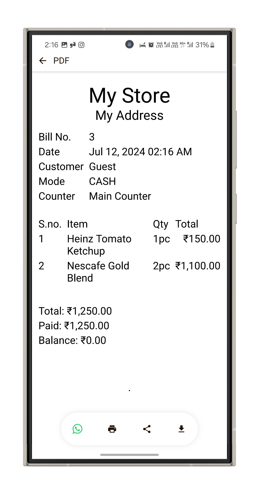
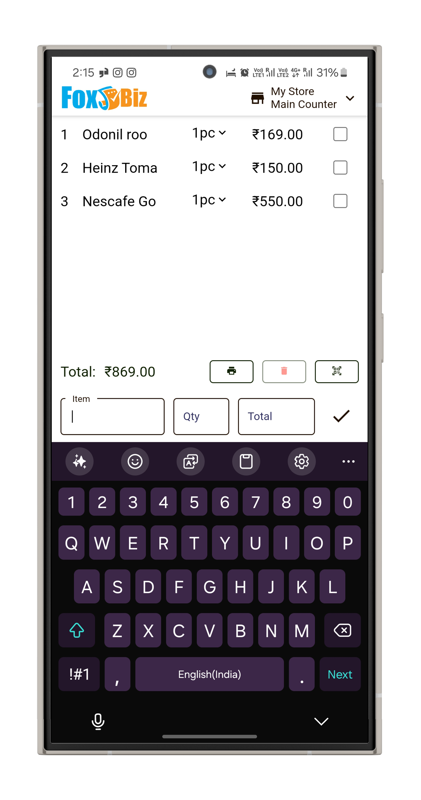

# Foxbiz Software Pvt. Ltd.

Welcome to the official GitHub profile of **Foxbiz Software Pvt. Ltd.** We are dedicated to providing advanced POS software solutions tailored for various businesses.

## Our Products

### Foxbiz POS

    
    

Foxbiz POS is a feature-rich point-of-sale system designed to streamline business operations with the following features:

- **Cross-Platform Support**: Available on Android, iOS, Windows, Mac, and Linux.
- **Simple UI/UX**: User-friendly interface designed for ease of use.
- **Fast Billing**: Efficient billing process for any type of business.
- **Multi-User & Multi-Device**: Supports multiple users and devices seamlessly.
- **Offline Mode**: Fully functional even without an internet connection.
- **Multi-Business & Multi-Counter Support**: Manage multiple businesses and counters effortlessly.
- **Multiple Language Support**: Available in various regional languages.
- **Hardware Integration**: Seamless integration with thermal printers and barcode scanners.
- **Self-Checkout**: Option for customers to checkout on their own.
- **Online Ordering**: Customers can order through a consumer app or WhatsApp.

## Our Vision

At Foxbiz Software Pvt. Ltd., our vision is to revolutionize the way businesses operate by providing robust and reliable POS solutions. Our goal is to enhance business efficiency and customer satisfaction through our innovative products.

## Registration & Consumer Apps

### Businesses

If you are a business looking to register with us, please visit [Foxbiz App](https://foxbiz.app).

### Consumers

Consumers can shop and order products/items from all registered businesses through our dedicated app. Visit [Foxbiz Store](https://foxbiz.store) to start shopping.

## Contact Us

For more information, visit our [official website](https://www.foxbiz.io) or reach out to us at:

- **Email**: contact@foxbizsoftware.com
- **Phone**: +123-456-7890
- **Address**: 123 Business Street, Tech City, Country

**Note**: We also own the domain [foxbizsoftware.com](https://www.foxbizsoftware.com).

## Follow Us

Stay connected and follow us on our social media channels for the latest updates:

## Repository Overview

Explore our repositories to find the source code for our products, documentation, and other resources.

We welcome contributions from the community. If you have suggestions, find any issues, or want to contribute, please open an issue or submit a pull request.

## License

Our projects are licensed under the MIT License. For more details, refer to the specific repository's README.

---

Thank you for visiting our GitHub profile. We are excited to collaborate with you and improve our products together.
